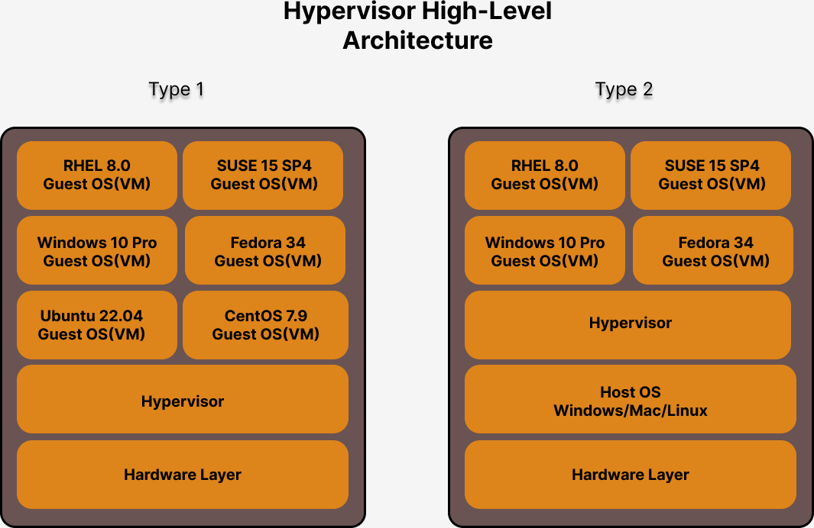

## Processors Packaging
- Two types of Packaing
  1. Single Chip Module (SCM - One IC has one Processor )
  2. Multiple Chip Module (MCM - One IC will have multiple Processors ) 

## Server Grade Motherboards
- supports multiple Processor Sockets
- Assume the Server has 4 Processors Sockets
- Assume we are installing MCM based Processor, i.e each IC with 4 Processors
- Assumne each Processor has 256 CPU Cores
- Total CPU Cores = 16 x 256 = 4096 CPU Cores

## Info - How many physical servers are required to support 1000 Operating System when no virtualization supported
- 1000 Physical servers are required
- Your organization has to procure 1000 servers
- we need a lab facility with power, network, 
, sound-proofed room
- servers are power hungry, they normally tend to consume more power(electricity)
- real-estate expenses
- if you need huge lab room, then the rental/lease cost for the lab facility will also be more
- 
## Info - Hypervisor Overview
<pre>
- is virtualization software
- with virtualization software, we can run multiple Operating Systems in the laptop/desktop/workstation/server
- many OS can run simultaneously
- we are able to consolidate more physical servers with minimal number of physical servers
- this type of virtualization is called heavy-weight virtualization, the reason is each Virtual Machine must be allocated with dedicated hardware resources
  - CPU
  - Memory (RAM)
  - Storage ( Hard Disk or SSDs )
  - Network Card
  - Graphics Card
- there are 2 types of virtualization software or hypervisors
  - type 1
    - is also called as Bare Metal Hypervisors
    - to create Virtual Machines(VM) we don't need to have a Host Operating System
    - Examples
      - VMWare vCenter/vSphere
  - type 2
    - this type of hypervisor is installed in laptops/desktops/workstations
    - in laptops/desktops/workstations normally we will already one primary Operating system
      - it could be Windows/Linux/Mac
      - the Primary OS installed on the Laptop/Desktop/Mac is called Host Operating System
    - the virtualization software is installed on top of the Host OS
    - each Operating System that we install on top of the Hypervisor is called Guest Operating System
    - each Guest OS is installed within a Virtual Machine
    - each Virtual Machine(VM) represents one Operating System
    - Examples
      - VMWare Workstation ( supported in Linux/Windows )
      - VMWare Fusion ( supported in Mac OS-X )
      - Oracle VirtualBox
      - Parallels ( supported in Mac OS-X )
      - KVM - opensource hypervisor software supported in all Linux distributions
      - Microsoft Hyper-V
</pre>

## Hypervisor - High Level Architecture


## Info - What is the minimal number of Physical servers required to host 1000 Virtual Machine on top of Hypervisor software ?
<pre>
- 1 Physical server is enough to host 1000 Virtual Machines
- HyperThreading
  - each Physical CPU Core is capable of running 2 threads parallely
  - hence each Physical CPU Core is treated/seen as 2/4/6 virtual/logical CPU Cores
- Server Configuration
  - Processor with atleast 512 CPU Cores ( 1024 virtual CPU Cores )
  - 1 TB or more RAM
  - 10 TB or more Storage ( Hard Disk or Solid Slate Disks )
</pre>

## Info - Containerization
<pre>
- is an application virtualization technology
- is called light-weight virtualization technolgy
  - because container's don't get their own dedicated hardware resources
  - all containers running in the same OS shares the Hardware resources from underlying OS 
- each container represents a single application or a single application process
- container is not an Operating System
- container doesn't have OS Kernel
- containers will never be able to replace an Operating System
- containers will never be able to replace a virtual machine or Hypervisors softwares
- containers is not a replacement/alternate to Virtualization or Hypervisors of OS
- commons characteristics between a virtual machine and a container
  - containers get their own IP address just like virtual machines
  - containers has file system just like virtual machines
  - containers has their own network card (virtual) just like virtual machines
  - container has their own network stack just like virtual machines
  - containers has their own Port range ( 0-65535 ports ) just like virtual machines
  - container represents a single application, while virtual represents an fully functional OS
- containers and hypervisors are complementing technology not competing technology
- containers runs on top of some Operating System
- containers shares the Hardware resources from the underlying Operating System ( Host or Guest OS )
</pre>

## Info - Docker High-Level Architecture


## Info - What is Container Runtime?
<pre>
- is a low-level software to manage containers and container images
- is not user-friendly, hence end-user like us generally won't use container runtimes
- examples
  - runC is a Container Runtime
  - CRI-O is a container runtime
</pre>

## Info - What is Container Engine?
<pre>
- is a high-level software to manage containers and container images 
- is user-friendly
- internally container engines depends on Container Runtime to manage containers and images
- examples
  - Docker is a Container Engine that depends on containerd which in turn depends on runC Container Runtime
  - Podman is a Container Engine that depends on CRI-O Container Runtime
</pre>

## Info - What is Docker Image?
<pre>
- is a blueprint of a Container
- it has one application and all its dependent softwares, libraries, etc required to run the application
</pre>

## Info - What is a Docker Container?
<pre>
- container is an instance of a Docker Image
- all the sofwares and tools that are installed in the docker image are available in each container created from a Docker Image
- container gets a Private IP address
- containers also files/folders ( file system )
- container has port-range ( 0-65535 )
- container has virtual network cards ( software defined network cards )
</pre>

## Info - What is Docker Registry
<pre>
- Docker Registry it is a server that hosts multiple Docker Images
- Usually uses Sonatype Nexus or JFrog Artifactory 
- Local Docker Registry is a just a folder on your system
- Remote & Private Registry, they are servers which could be powered by either Nexus or Artifactory
</pre>  

## Info - Docker Overview
<pre>
- Docker is a Container Engine
- follows Client/Server Architecture
- it comes in 2 flavours
  1. Docker Community Edition - Docker CE
  2. Docker Enterprise Edition - Docker EE
- Docker supports 3 types of Container Registries
  1. Local Docker Registry
  2. Private Docker Registry and
  3. Remote Docker Registry
- it is developed in Go lang by Docker Inc organization
</pre>

## Info - Docker Alternatives
<pre>
- containerd
- Podman
- LXC
</pre>

## Info - Container Orchestration Platforms
- Container Orchestration Platforms helps managing your containerized application workloads
- they manage your applications
- they have inbuilt
  - application monitoring features ( health check, readiness check, liveliness check )
  - it can repair your application when it stops responding
  - it can scale up/down your application instances when the user traffic to application increases/decreases
  - it can help your rollout new application version without any downtime
  - self-healing
  - it support load-balancers
  - it supports exposing your application to internal applications or to external world as services
  - it supports service discovery
  - it supports CI/CD ( Google Kubernetes & Openshift supports this )
  - it supports serverless architecture ( Google Kubernetes & Openshift supports this )
- Examples
  - Docker SWARM 
  - Google Kubernetes
  - Red Hat Openshift
 
## Lab - Installing Docker community edition in Ubuntu 24.04
```
# Add Docker's official GPG key:
sudo apt-get update
sudo apt-get install ca-certificates curl
sudo install -m 0755 -d /etc/apt/keyrings
sudo curl -fsSL https://download.docker.com/linux/ubuntu/gpg -o /etc/apt/keyrings/docker.asc
sudo chmod a+r /etc/apt/keyrings/docker.asc

# Add the repository to Apt sources:
echo \
  "deb [arch=$(dpkg --print-architecture) signed-by=/etc/apt/keyrings/docker.asc] https://download.docker.com/linux/ubuntu \
  $(. /etc/os-release && echo "$VERSION_CODENAME") stable" | \
  sudo tee /etc/apt/sources.list.d/docker.list > /dev/null
sudo apt-get update

sudo apt-get install docker-ce docker-ce-cli containerd.io docker-buildx-plugin docker-compose-plugin -y

sudo systemctl enable docker
sudo systemctl start docker
sudo usermod -aG docker $USER
sudo su $USER
docker --version
docker images
```
