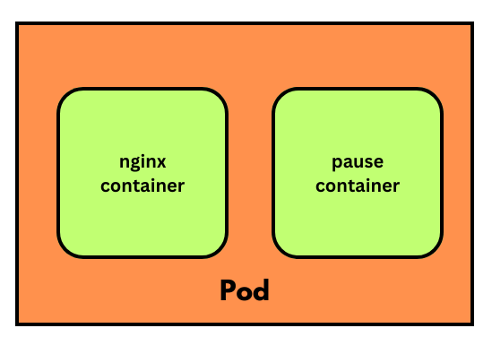
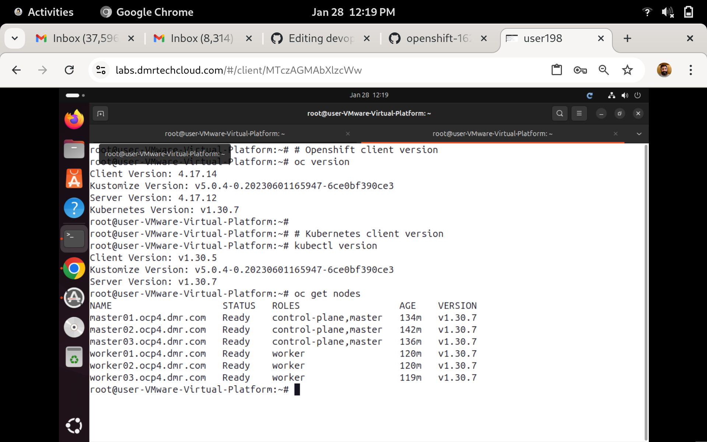
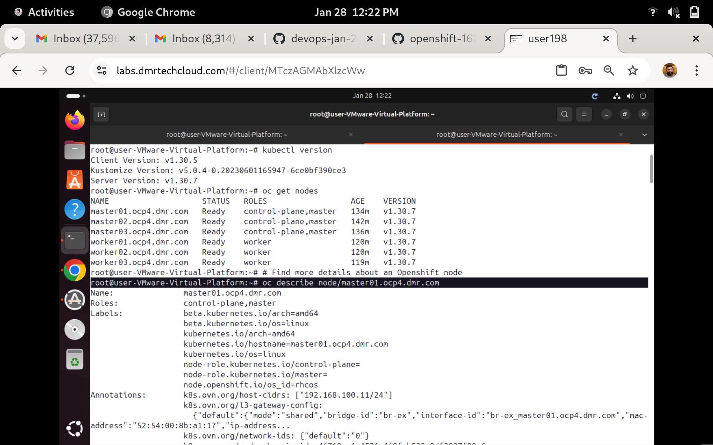
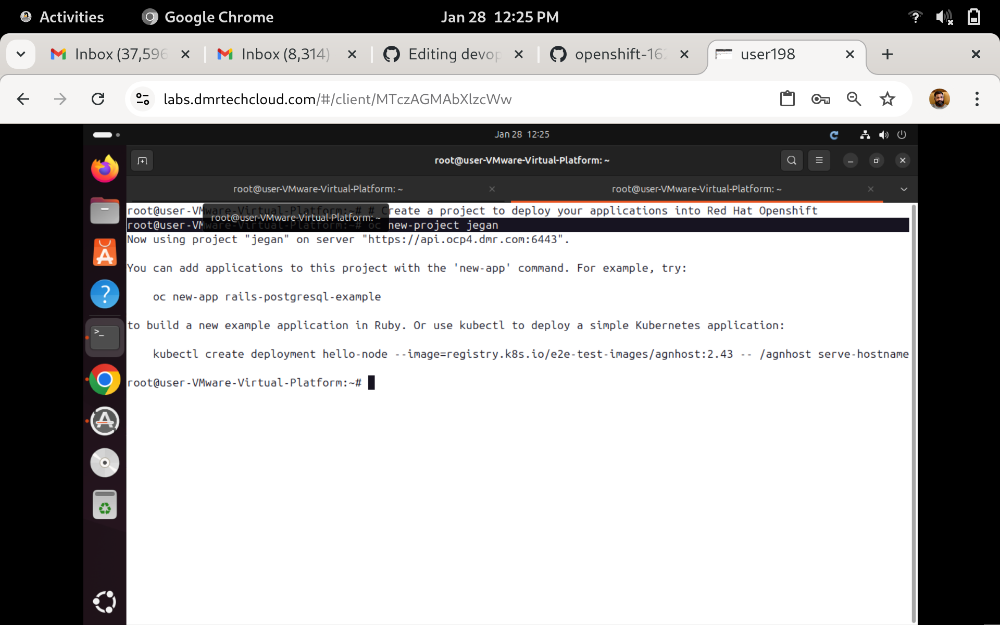

# Day 3

## Info - Why Red Hat Openshift supports only Podman and not Docker
<pre>
- Upto Red Hat Openshift v3.11, docker was the default container engine supported by Kubernetes and Openshift
- Docker had a security flaw, which gives administrative access to non-administrators
- There was a company called CoreOS with 2 interesting products
  1. rkt - container runtime
  2. Core OS - an operating system that enforces all best practices of Container Orchestration Platform
     - comes in 2 flavours
       - Fedora Core OS - opensource
       - Red Hat Enterpise Core OS ( RHCOS ) - used by paid variant of Openshift
- Red Hat acquired the Core OS company
  - they killed rkt container runtime, instead they developed CRI-O container runtime as an opensource product
  - Podman is the container engine which internally uses CRI-O container runtime
  - starting from Red Hat Openshift v4.x onwards
    - docker support was removed
    - openshift v4.x supports only CRI-O Container Runtime and Podman Container Engine
    - Red Hat Core Enterprise Core OS - is used in all master nodes within openshift
    - Red Hat Core Enterprise Core OS - can also be installed optionally in openshift worker nodes apart from RHEL  
</pre>

## Info - Container Orchestration Platform Overview
<pre>
- though containers and images can be managed manually using Container Engines/runtimes, that is not the way it is used in the industry
- container orchestration platforms helps us manage containerized application workloads
- features supported
  - any containerized applications can be deployed 
  - High Availability (HA)
  - light-weight
  - allows deploying applications built in different programming languages
  - scale up/down manually/automatically
  - rolling update
    - helps in upgrading your application from one version to other without any downtime
    - can also undo i.e rollback to immediate previous version to any older version of the same application
  - service discovery
  - inbuilt monitoring facility
  - inbuilt load-balancing
  - security 
- Examples
  1. Docker SWARM
  2. Kubernetes
  3. Openshift
</pre>

##  Info - Docker SWARM Overview
<pre>
- Docker's native Container Orchestration Platform
- opensource
- supports deploying only a Docker based containerized application workloads
- it is easy to install and learn
- it is also very light-weight, i.e can be installed on laptops with an average hardware configuration
- it is generally used for learning, POC purpose
- not a production-grade Container Orchestration Platform
</pre>

## Info - Kubernetes Overview
<pre>
- container orchestration platform
- supports many container runtimes and engines
- developed by Google in Go lang
- it is opensource
- supports only command-line
- production grade Container Orchestration Platform
- can be installed on laptops/desktops/workstation/server
- node can be
  - physical machine
  - can be a Virtual machine
  - can be an ec2 instance running in AWS
  - can be an azure VM from Azure cloud
- kubernetes cluster is a combination of many master nodes and many worker nodes
- it is even possible to create a single node Kubernetes cluster that acts as both master and worker node
- Kubernetes master nodes runs a special group of components called Control Plane Components
  - API Server
  - etcd database
  - Controller Managers
  - Scheduler
- Kubernetes supports extending Kubernetes API/features by adding your custom resources and custom controller
- Kubernetes master and nodes allow us to install any Linux distribution
- Kubernetes supports any container runtime/engine that implements CRI(Container Runtime Interface)
- AWS supports managed Kubernetes cluster called EKS
- Azure supports managed Kubernetes cluster called AKS
- Kubernetes provides all features to make it secure, but the ownus is us, it is not secured out of the box
</pre>

## Info - Red Hat Openshift Overview
<pre>
- is Red Hat's Kubernetes distribution
- developed on top of opensource Google Kubernetes with many additional features
- it is a superset of Kubernetes, hence all features of Kubernetes are also supported in Openshift
- Red Hat Openshift supports only RHCOS in master nodes and either RHCOS/RHEL in worker nodes
- supports only CRI-O Container runtime and Podman Container engine
- enterprise product that requires commercial license
- supports many additional features
  - Web console
  - Internal Openshift Image Registry
  - Source to Image (S2I)
    - deploying application from source code
    - deploying application using Dockerfile
  - supports CI/CD
  - supports routes to expose application for external access
  - supports user management
- AWS supports managed Red Hat Openshift cluster called ROSA
  - Load Balancer creates an external Load Balancer supported by AWS
  
- Azure supports managed Red Hat Openshift cluster called ARO
  - Load Balancer creates an external Load Balancer supported by Azure

- As Red Hat Openshift makes use of Red Hat Enterprise Core OS, it is secure already
  - Ports below 1024 are not allowed as it is reserved for internal use
  - not all applications can be deployed with root access
  - it can be made more secure by using network policy like we do in Kubernetes
  - it will enforce best practices are followed which are not taken so seriously
</pre>

## Info - Openshift onPrem vs Cloud
<pre>
- onPrem Openshift 
  - installation of openshift we need to take care
  - Red Hat Openshift license are taken care by us
  - backup is our responsibility
  - we need to decide the master/worker node hardware configuration as per our application workload and user traffic
  - add new nodes into cluster is done manually using Openstack, VMWare vSphere, etc.,
  - Metallb operator or similar operators must be used to support LoadBalancer service in a on-prem openshift setup like our lab setup

- AWS ROSA
  - installation of openshift is taken care by AWS
  - Red Hat Openshift license is taken care by AWS
  - Hardware configuration of master nodes are decided and managed by AWS
  - backup of etcd database is taken care by AWS
  - LoadBalancer service when created it will automatically create AWS ALB/ELB as it is tighly integrated with AWS
</pre>

## Info - Control Plane Components
<pre>
1. API Server Pod
2. etcd database Pod
3. Scheduler Pod
4. Controller Managers Pod
</pre>

Things to note
<pre>
- Control Plane components are started by kubelet service that runs in every node
- the Control Plane components are also called static pods
- Each node has a registered standard folder called /etc/kubernetes/manifest, this folder contains yaml definitions to create the control plane components
- The /etc/kubernetes/manifests folder is registered with kubelet service, hence once the kubelet service starts running it will get to know the static pod location, it then creates the control plane components using the respective yaml files in /etc/kubernetes/manifests folder
- it is possible, we also could copy some of our manifest files in the /etc/kubernetes/manifests folder, the kubelet will start them
- the pods that are created by kubelet are called static pods
</pre>


## Info - Red Hat Openshift High-Level Architecture


## Info - Pod Overview
<pre>
- a group of related containers
- one application per Pod is the general recommended best practice
- every Pod has a secret infra-container called pause-container which supports the networking features
- no Pod should contain more than one main application
- all the containers in the same Pod shares the same IP address and ports
</pre>


## Info - Kube config file
- the oc/kubectl client tools requires a config file that has connection details to the API Server(load balancer)
- the config file is generally kept in user home directory, .kube folder and the default name of kubeconfig is config
- optionally we could also use the --kubeconfig flag with the oc command to point to a config file
- it is also possible to use a KUBECONFIG environment variable to point to the config file
- Just to give an idea, it is possible that your Kubernetes/OpenShift is running in AWS/Azure but you could install oc/kubectl client tool on your laptop with a config file and still run all the oc/kubectl commands from your laptop without going to aws/azure

To print the content of kubeconfig file
```
cat ~/.kube/config
```
## Info - About Red Hat Enterpise Core OS ( RHCOS )
- an optimized operating system created especially for the use of Container Orchestration Platforms
- each version of RHCOS comes with a specific version of Podman Container Engine and CRI-O Container Runtime
- RHCOS enforces many best practices and security features
- it allows writing to only folders the application will has read/write access
- if an application attempts to modify a read-only folder RHCOS will not allow those applications to continue running
- RHCOS also reserves many Ports for the internal use of Openshift
- User applications will not have write access to certain reserved folders, user applications are allowed to perform things as non-admin users only, only certain special applications will have admin/root access

###  Info - Points to remember
- Red Hat Openshift uses RedHat Enterprise Linux Core OS
- RHCOS has many restrictions or insists best practises
- RHEL Core OS reserves ports under 1024 for its internal use
- Many folders within the OS is made as ready only
- Any application Pod attempts to perform write operation on those restricted folders will not be allowed to run
- For detailed documentation, please refer official documentation here https://docs.openshift.com/container-platform/4.8/architecture/architecture-rhcos.html

## Info - Pod Lifecycle
- Pending - Container image gets downloads or there are no Persistent Volume to bound and claim them
- Running - The Pod is scheduled to a node and all containers in the Pod are up and running
- Succeeded - All containers in the Pod have terminated succesfully and not be restarted
- Failed - All containers in the Pod have terminated but one or more containers terminated with non-zero status or was terminated by Openshift
- Unknown - For some reason, the state of the Pod could not be obtained may be there is some problem in communicating to the node where the Pod is running

## Info - Container Lifecycle
- Waiting - pulling the container image
- Running - container is running without issues
- Terminated - container in the Terminated state began execution and then either ran to completion or failed for some reason

## Lab - Listing the Red Hat Openshift cluster nodes
```
oc get nodes
```
Expected output


## Lab - Finding more details about the Openshift nodes
```
oc describe node/master01.ocp4.dmr.com
oc describe node/master02.ocp4.dmr.com
oc describe node/master03.ocp4.dmr.com
oc describe node/worker01.ocp4.dmr.com
oc describe node/worker02.ocp4.dmr.com
oc describe node/worker03.ocp4.dmr.com
```
Expected output


## Lab - Creating a project to deploy your applications into Openshift
```
oc new-project jegan
```

Expected output


## Lab - Finding the currently active project 
```
oc project
```

Expected output


## Lab - Switching between projects
```
oc project default
oc project jegan
```

Expected output


## Lab - Deploying nginx web server into openshift
```
oc project jegan
oc create deployment nginx --image=bitnami/nginx:latest --replicas=3
```

Listing the deployments
```
oc get deployments
oc get deployment
oc get deploy
```

Listing the replicasets
```
oc get replicasets
oc get replicaset
oc get rs
```

Listing the pods
```
oc get pods
oc get pod
oc get po
```

Finding the IP address of the Pods
```
oc get pods -o wide
```

Expected output

